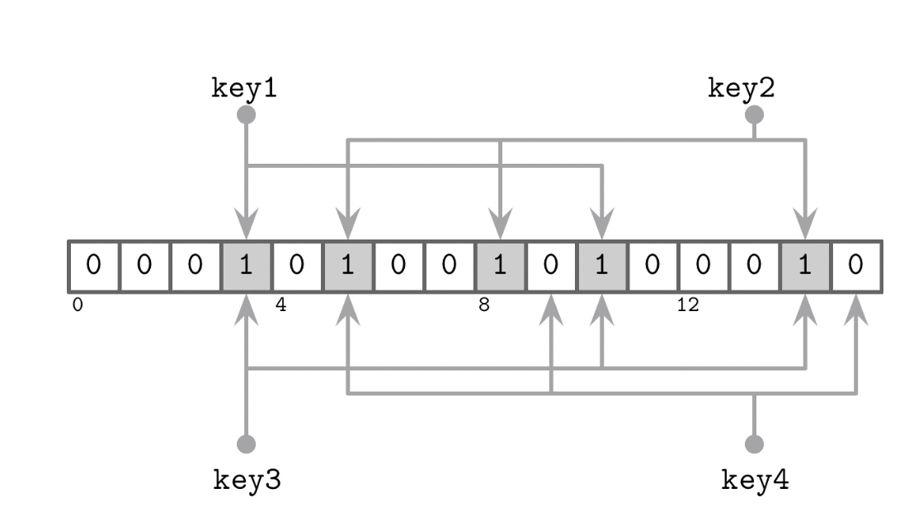

# Read, Write, and Space Amplification

### 읽기 증폭 (Read Amplification)  
- 데이터를 가져오기 위해 여러 테이블을 참조해야 하는 필요에서 발생
     - 예: 메모장에 같은 단어가 여러 페이지에 흩어져 있으면 찾을 때 시간이 더 걸리는 상황

### 쓰기 증폭 (Write Amplification)
- 컴팩션 과정에서 지속적인 재작성으로 인해 발생
    - 예: 같은 데이터를 여러 번 디스크에 기록해야 하는 경우
- 중복 데이터를 제거하려고 자주 compaction할 경우 발생

### 공간 증폭 (Space Amplification)
- 동일한 키와 연관된 여러 레코드를 저장함으로써 발생
    - 예: 사진 파일이 중복 저장되어서 저장 공간을 더 차지하는 경우

 

> 중복 데이터를 빨리 제거하면? Write↑, Read/Space↓   
> 중복 데이터를 오래 두면? Write↓, Read/Space↑

## RUM Conjecture
저장 구조에 대한 비용 모델 중 하나로 `읽기`, `업데이트`, `메모리 오버헤드`라는 세 가지 요소를 고려한 가설
RUM의 세 가지 요소:   
- **R** (Read overhead): 데이터를 읽을 때 드는 비용
- **U** (Update overhead): 데이터를 수정/갱신할 때 드는 비용
- **M** (Memory overhead): 메모리를 사용하는 정도

RUM 가설: RUM의 세 요소 중 두 가지를 동시에 줄이면 나머지 한 가지는 **반드시 증가함**   
이상적인 상황이라면? 읽기 비용 최소 + 메모리 오버헤드 최소 + 쓰기 오버헤드 최소 -> 하지만 현실에서는 **불가능**하다!

- B-Tree
    - +) 읽기 성능이 뛰어남 (레코드의 위치를 찾기 쉬움, 범위 검색이 효율적임)
    - -) 쓰기 시 디스크 페이지를 여러 번 수정해야 하고, 나중의 업데이트를 위해 남겨둔 여유 공간이 낭비됨

- LSM Tree
    - +) 쓰기 효율이 높음 (쓰기 시 디스크 탐색이 필요 없음)
    - -) 읽기 시 여러 SSTable을 탐색해야 하므로 읽기 비용이 크고, 데이터가 중복 저장되어 공간 오버헤드가 존재

> RUM 가설은 지연 시간, 구현 복잡도, 하드웨어 특성, 일관성과 복제 등 여러 요소를 고려하지 않으므로 `한계가 있는 모델`이지만 새로운 설계를 선택할 때 `대략적인 방향`을 잡기 위한 기준으로 활용할 수 있음

 

# Implementation Details
LSM Tree의 구현 세부사항

## Sorted String Tables (정렬 문자열 테이블, SSTables)
키 순서대로 `정렬`된 `불변` 데이터 파일로 디스크에 저장되는 LSM Tree의 기본 단위

- 구성 요소
    - 인덱스 파일: 키 -> 데이터 위치(`offset`) 매핑 저장
        - **로그** 시간 탐색 구조: B-Tree
        - **상수** 시간 탐색 구조: 해시테이블
            - 해시 테이블을 사용하더라도 범위 스캔 가능 -> 데이터파일이 키 순서대로 정렬되어 있으므로 해시테이블은 첫 번째 키를 찾는 데만 사용, 이후 순차적으로 읽으면 됨
    - 데이터 파일: 실제 `key-value` 레코드 저장, 키 순서로 정렬

- Compaction
    - 데이터가 이미 키 순서로 정렬되어 있어 인덱스가 없어도 순차적으로 읽을 수 있음
    - 병합이 순서를 보존하므로 결과물도 키 순서로 정렬됨
    - **새로 만들어진 SSTable은 즉시** `immutable` **처리 됨**
        - 예: 책을 다 쓰고 난 뒤에는 내용을 수정하지 않고 새 책을 내는 것과 비슷한 개념

> **SASI: SSTable-Attached Secondary Indexes** -> ?🔎   
> LSM Tree의 보조 인덱싱 기법으로 primary key 외의 다른 필드로도 검색이 가능하게 함

## Bloom Filters
LSM 트리에서는 데이터가 여러 SSTable로 나뉘어 저장됨 -> 읽기 증폭 발생

Bloom 필터: 공간 효율적인 확률적 자료구조, 특정 요소가 `집합에 속하는지 여부를 판별`하는 데 사용됨
- 거짓 긍정 (false positive) 발생 `가능`: 실제로는 존재하지 않지만 집합에 속한다고 잘못 판단할 수 있음
- 거짓 부정 (false negative) 발생 `불가능`: 집합에 속하지 않는다고 판단하면 해당 요소는 반드시 집합에 존재하지 않음

> Bloom 필터는 특정 키가 테이블에 `있을 가능성`이 있는지, 아니면 `절대 없는지`를 판별하는 데 사용

### 작동 원리
- 구성 요소
    - 큰 Bit Array
    - 여러 개의 해시 함수
- 삽입
    1. 키를 여러 해시 함수에 넣어 인덱스 값 도출
    2. 해당 비트 배열 위치를 모두 1로 설정
- 조회
    1. 키를 동일한 해시 함수로 해싱
    2. 모든 지정 위치 비트가 1이면? `있을 가능성 있음`
    3. 하나라도 0이면? `절대 없음`

> 왜 확실하지 않게 있을 가능성으로 판단할까?
> - 해시 충돌: 서로 다른 키를 해시했는데 비트 배열 내 동일한 위치가 나오는 경우 발생
>   - Bloom 필터에서는 여러 해시 함수를 사용하므로 여러 위치 중 일부에서 충돌이 발생할 수 있음
> - 특정 키를 조회할 때, 그 키가 설정해야 할 모든 비트가 이미 이전에 다른 키들에 의해 1로 설정되어 있다면 실제로는 그 키를 삽입한 적이 없어도 `있을 가능성이 있다`고 판단   
> **정리하면,**   
> 해시 충돌이 일어나면 비트 1 중복 설정을 만듦 -> 충돌이 누적되어 어떤 키의 모든 해시 위치가 이미 1로 차있다면 오탐이 발생한다!

지피티 무료 이슈로 일단 여기까지...
