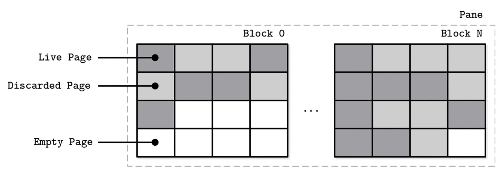
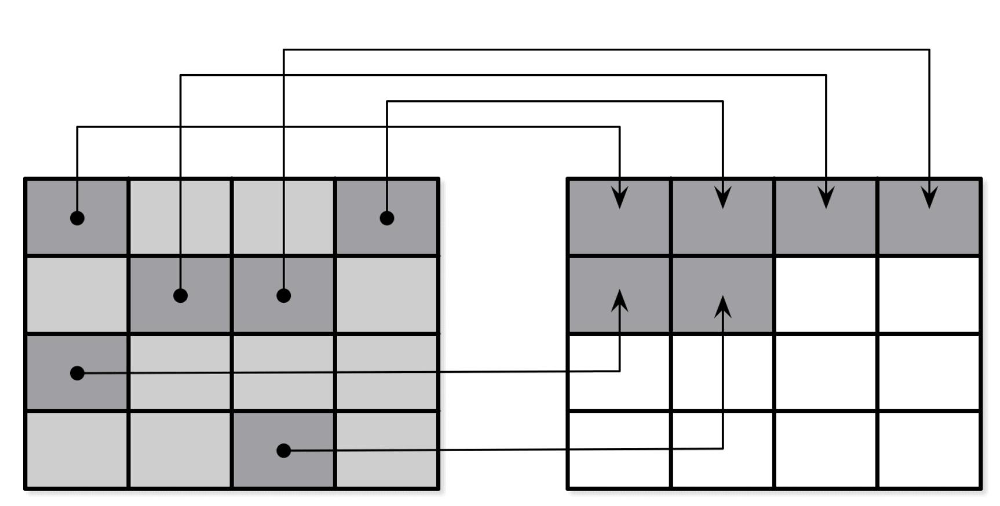

# Concurrency in LSM Trees

- 테이블 뷰 전환: 여러 스레드가 동시에 데이터를 읽고 쓰는 상황에서 메모리와 디스크의 테이블 구성이 변경되는 문제
- 로그 동기화: 여러 작업이 동시에 WAL(Write-Ahead Log)에 기록하거나 읽을 때의 동기화 문제

## LSM Tree에서 flush 작업 중 반드시 지켜야 할 5가지 규칙
1. 새 메모리 테이블 활성화: 새로운 memtable이 즉시 읽기/쓰기 작업을 받을 수 있어야 한다
2. 기존 테이블 가시성 유지: 플러시 중인 memtable은 디스크 저장이 완료될 때까지 읽기 요청에 응답해야 한다
3. 디스크 저장 완료: 메모리의 데이터가 안전하게 디스크에 기록되어야 한다
4. 원자적 전환: 메모리 테이블 제거와 디스크 테이블 활성화가 동시에 일어나야 한다
5. 로그 정리: 해당 메모리 테이블과 관련된 WAL 세그먼트를 안전하게 삭제해야 한다

> Apache Cassandra는 `Operation Order Barriers`를 사용하여 동시성 문제를 해결한다
> <br><br>
> **작업 순서 장벽 (Operation Order Barriers)** -> 
> 플러시가 시작되기 전에 진행 중인 모든 쓰기 작업의 완료를 기다림 = `소비자`는 모든 `생산자`가 작업을 완료할 때까지 기다려야 함
> - 생산자: 데이터를 memtable에 쓰는 여러 스레드들
> - 소비자: memtable을 디스크로 플러시하는 프로세스
> ---
> 작동 원리:
> 1. 여러 쓰기 작업이 동시에 memtable에 데이터를 입력
> 2. 플러시가 필요한 시점이 되면 **Barrier** 설치
> 3. Barrier 이전에 시작된 모든 쓰기 작업의 완료를 기다림
> 4. 모든 작업이 완료되면 안전하게 플러시 시작

## LSM Tree에서 발생하는 3가지 핵심 동기화 지점

1. **Memtable Switch 멤테이블 전환**: 새로운 쓰기는 새 memtable로 이동
 
2. **Flush Finalization 플러시 완료**: 기존 memtable 내용을 디스크 SSTable로 완전 이전

3. **Write-Ahead Log Truncation 선행 기록 로그 절단**: 불필요한 WAL 부분 정리

### 3가지 동기화 지점이 잘못 처리되면 어떻게 될까?
- 데이터 손실 문제 -> 잘못된 쓰기가 지속됨
    - 예: Memtable Switch가 제대로 이루어지지 않아 기존 memtable에 계속 쓰기가 발생한다면?
        - 해당 영역은 이미 완료된 것으로 간주되어 더 이상 디스크에 반영되지 않음
        - 새로 추가된 데이터가 *영구적으로 손실*된다!

- 불완전한 읽기 결과 -> 너무 빠른 memtable 제거
    - 예: 디스크 테이블이 완전히 준비되기 이전에 memtable을 읽기에서 제외한다면?
        - 읽기 요청 시 일부 데이터를 찾을 수 없어 *부분적인 결과만 반환*하게 된다!

## Compaction 과정에서의 동기화 문제 
compaction: 기존 디스크 테이블들이 폐기되고 컴팩션된 버전이 추가됨 -> 공간 효율성, 읽기 성능, 유지보수 측면에서 좋음
> 플러시: 메모리 ↔ 디스크 간의 전환   
> 컴팩션: 디스크 ↔ 디스크 간의 교체
- 새로운 테이블이 완전히 작성되고 대체될 때까지 읽기 가능한 상태로 남아있어야 함
- 같은 테이블이 여러 컴팩션 작업에 동시에 참여하는 것은 피해야 함

> B-Tree와 LSM Tree에서 로그 관리   
> - **B-Tree**   
> 더티 페이지(메모리에서 수정되었지만 아직 디스크에 반영되지 않은 페이지)가 디스크로 완전히 저장된 후에만 해당 로그를 삭제할 수 있음
> - **LSM Tree**
> 쓰기 작업들이 메모리의 memtable에 임시 저장되고 memtable 플러시 완료 후에만 해당 WAL 세그먼트를 삭제할 수 있음
> <br><br>
> *플러시가 완료되기 전에 로그 세그먼트가 폐기되고 노드가 충돌되면 로그 내용을 재생할 수 없으므로 데이터를 복구할 수 없게 된다!*

# Log Stacking
여러 계층의 시스템이 각각 로그 구조화 방식을 사용하는 현상   
> 애플리케이션 -> 파일시스템 -> SSD 까지 다층적으로 적용됨

### 작동 방식
- 메모리 버퍼링: 쓰기 요청들을 메모리 세그먼트에 임시 저장
- 배치 플러시: 세그먼트가 가득 차면 한번에 디스크에 기록
- Append-Only: 기존 데이터를 덮어쓰지 않고 항상 끝에 추가 

+) 작은 쓰기들을 모아서 큰 단위로 처리하므로 성능이 향상되고 순차적으로 쓰기 때문에 일관성이 생김

### SSD가 로그 구조화 저장소를 사용하는 이유
1. 작은 랜덤 쓰기 처리   
SSD 는 작은 랜덤 쓰기에 비효율적이므로 모아서 큰 블록 단위로 처리
2. 쓰기 오버헤드 최소화   
데이터 수정 시 새로운 위치에 추가하고 나중에 정리
3. Wear Leveling 개선   
SSD의 모든 셀을 고르게 사용하여 특정 영역이 집중적으로 사용되는 것을 방지
4. 장치 수명 증가     
플래시 메모리는 쓰기와 삭제 횟수에 제한이 있으므로 효율적인 쓰기를 통해 전체적인 쓰기 횟수 감소

### LSS (log-structured systems)의 문제점
다층 스태킹으로 인해 다음과 같은 문제가 일어날 수 있음:   
- 쓰기 증폭 재등장 (각 계층에서 독립적인 최적화로 인한 중복 작업 발생)
- 단편화 심화 (계층 간 불일치로 인한 데이터 흩어짐)
- 성능 저하 (여러 계층의 오버헤드 누적)

```
# 스태킹 구조

애플리케이션 (LSM Trees)
         ↓
파일시스템 (로그 구조)
         ↓
SSD FTL (플래시 변환 계층)
         ↓
물리적 플래시 메모리
```

## Flash Translation Layer

플래시 변환 계층 (FTL): 논리적 주소를 물리적 플래시 메모리 위치로 변환하는 역할   
로그 구조를 사용하는 두 가지 이유:   
1. 작은 랜덤 쓰기의 배치 처리   
플래시 메모리는 개별 바이트 단위 쓰기가 불가능하므로(보통 4KB~16KB) 여러 작은 쓰기를 모아서 하나의 페이지에 함꼐 기록함
2. program/erase cycles의 제약    
플래시 메모리는 쓰기 전에 반드시 지우기 작업이 필요하며 빈 페이지에만 새로운 데이터를 쓸 수 있음
    - 프로그램 = 쓰기   
    완전히 지워진 페이지에만 가능하며 한번 쓰인 페이지는 지우기 전까지 재사용할 수 없음   
    0 -> 1 변경은 불가능, 1 -> 0 변경만 가능함
    - 지우기   
    개별 페이지가 아닌 블록 단위로만 가능하며 모든 비트를 1로 초기화함

### 블록으로 그룹화된 페이지들의 개략적 표현 

  
FTL은 논리적 페이지 주소들을 물리적 위치로 변환하고 페이지의 상태(live, discarded, or empty)를 추적함   
FTL이 자유 페이지가 부족해지면 가비지 컬렉션을 수행하고 폐기된 페이지들을 지움
- Live Page   
현재 유효한 데이터를 포함하는 페이지   
읽기 요청 시 실제로 반환되는 데이터이므로 절대 지우면 안 됨
- Discarded Page   
더 이상 유효하지 않은 데이터를 포함하는 페이지   
데이터의 수정과 삭제로 인해 구버전이 된 페이지로 공간을 차지하지만 의미 없는 데이터
- Empty Page
지워져서 새로운 데이터를 쓸 수 있는 페이지   
즉시 사용 가능한 공간으로 FTL이 항상 확보하려고 하는 자원에 해당함

### Page relocation during garbage collection
지우려는 블록에 라이브 페이지와 폐기된 페이지가 섞여 있음 -> 블록 단위로만 지울 수 있지만 일부는 여전히 유효한 데이터이므로 지우면 안 됨


1. **라이브 페이지 식별**: FTL이 지울 블록 내의 모든 라이브 페이지를 찾음
2. **새로운 위치 찾기**: 빈 페이지를 가진 블록들을 검색하고 충분한 공간이 있는 블록을 선택함
3. **데이터 복사**: 라이브 페이지의 내용을 새 위치로 복사하고 논리-물리 주소 매핑 테이블을 업데이트함
4. **블록 지우기**: 모든 라이브 데이터를 이동한 후 전체 블록을 안전하게 지워 새로운 빈 페이지를 확보함

> ### SSD에서 로그 구조화 저장소 사용의 핵심 이유 요약
> 작은 랜덤 쓰기들을 함께 배치하여 ***I/O 비용 분할상환 (Amortization)***   
> -> 더 적은 수의 작업을 할 수 있게 됨 -> `가비지 컬렉션`이 트리거되는 횟수를 줄임

## Filesystem Logging


