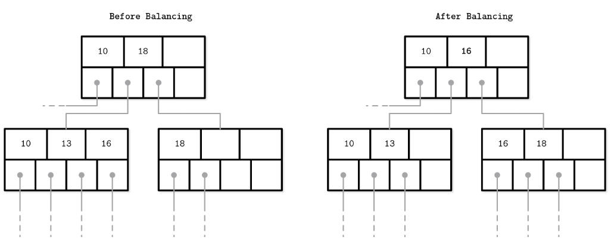

## Rebalancing
>`B-Tree`는 노드가 꽉 찼을 떄 둘로 나누는 작업인 `split`을, 노드가 너무 비었을 때는 이웃 노드와 합치는 작업인 `merge`를 수행함
>  
> => _이를 최대한 늦추기 위해 `Rebalancing`을 수행한다!_

`Rebalancing`: 트리의 균형을 맞추기 위해 노드 간 데이터를 재배치하는 작업

- +) Occupancy를 높이고 트리의 깊이(레벨 수)를 줄일 수 있음
    
    - `Occupancy`: 노드가 얼마나 꽉 차 있는지를 나타내는 정도, 높을수록 디스크 사용이 효율적임

- -) 재균형화를 위한 유지 관리 비용이 더 많이 들 수 있음

### 삽입 / 삭제 연산 중 Load Balancing   

Load Balancing: 기존 노드 내에서 데이터를 재배치하는 것

- **Insert**
  - 기존 노드가 꽉 차면 형제 노드로 일부 데이터를 옮겨 삽입할 공간을 확보
  - 단순 분할 (X)
- **Delete**
  - 기존 노드가 비게 되면 **이웃 노드에서 일부 데이터를 옮겨**와 해당 노드가 최소 절반 이상 차도록 유지 
    - B-tree는 일반적으로 노드가 절반 이상 차있지 않으면 merge됨
  - 형제 노드 병합 (X)

> **Rebalancing vs Load Balancing**
> - Rebalancing: 전체 구조의 최적화
>   - 전체 트리의 구조적 균형을 맞추는 작업
>   - split/merge 전에 미리 수행하여 트리 전반의 상태 조정
>     - e.g. 꽉 찬 노드에서 덜 찬 노드로 데이터를 옮기며 분할 지연
>    
> - Load Balancing: 즉각적인 삽입/삭제 대응
>   - 삽입/삭제 시 노드 간 데이터를 옮겨 공간을 확보하는 작업
>   - 삽입 또는 삭제 직전/직후 연산
>     - e.g. 삽입 시 노드가 꽉 차면 옆 노드로 데이터 일부를 옮겨 공간 확보

### B*-Tree의 Split
B-Tree는 양쪽 형제 노드가 모두 가득 찰 때까지 데이터를 인접한 노드들로 계속 분산함   
양쪽이 다 차면? *노드를 분할한다!*
- 1개의 노드 -> 1/2정도 찬 2개의 노드로 분할 (X, 일반적인 B-Tree)
- 2개의 노드 -> 2/3정도 찬 3개의 노드로 분할 (O)
=> SQLite도 이 구조를 사용

   

- 왼쪽 노드에서 오른쪽 노드로 데이터를 옮겨 rebalancing이 이루어짐
- 노드의 **최소/최대값 경계 (min/max invariant)** 가 바뀌므로 **부모 노드의 키와 포인터도 함께 업데이트**해야 함

---
## Right-Only Appends
- 대부분의 DB는 자동 증가 키를 인덱스 키로 사용
  - e.g. 1, 2, 3...
- 이 경우 **삽입이 항상 오른쪽 끝에서 일어남**
- +) Update/Delete가 적고 Insert 위주일 경우 중간 노드들(nonleaf pages)은 거의 영향을 받지 않음
  => `Fragmentation이 거의 없다!`
  - Fragmentation: 데이터가 중간에 삭제되거나 업데이트되며 공간이 비효율적으로 나뉘는 현상

### PostgreSQL: fastpath
PostgreSQL은 right-only append 최적화를 fastpath라고 함
> 1. 새로운 키가 오른쪽 끝 페이지의 가장 큰 키보다 더 크고
> 2. 페이지에 공간이 충분하면   

=> 트리를 다시 탐색하지 않고 **캐시에 있는 오른쪽 끝 리프 노드에 바로 삽입**한다!

### SQLite: quickbalance
SQLite에서 가장 오른쪽 노드가 가득 찬 상태로 삽입이 발생할 경우:
1. 새로운 오른쪽 노드를 생성하고 (split, rebalancing X)
2. 그 포인터를 부모 노드에 연결한다

> **fastpath(PostgreSQL) vs quickbalance(SQLite)**   
> 둘 다 단조증가하는 키 삽입을 최적화하기 위한 전략

|          | fastpath             | quickbalance                   |
|----------|----------------------|--------------------------------|
| 개념       | 전체 탐색 경로 생략          | split 대신 새 노드 생성               | 
| 목적       | 빠르게 삽입을 처리해 성능을 최적화함 | split/rebalance를 회피하여 구조를 간소화함 |
| 언제 사용하는가 | 자리가 있을 때 | 꽉 찼을 때                         |
| 구조 변경 여부 | X                    | O (노드/포인터 추가)                  |

### Bulk Load
미리 정렬된 데이터를 한꺼번에 적재하는 경우 -> 이미 정렬되어 있으므로 **단순히 트리의 가장 오른쪽 위치에 항목들을 추가**하면 됨
- split/merge 없이 트리를 구성 -> 삽입 중 트리를 수정할 필요 없음
- 트리를 `bottom-up`으로 구성
  - 리프 노드들을 채운 후 하위 노드들이 충분히 쌓이면 상위 노드를 채움
  - 실시간 삽입은 보통 `top-down`
> One approach for implementing `Bulk Load`
> 1. 미리 정렬된 데이터를 leaf 레벨에서 **페이지 단위**로 기록
>    - 데이터를 개별적으로 삽입하는 것이 아님!
> 2. 각 리프 페이지를 기록한 후 그 페이지의 첫 번째 키를 부모 노드에 등록
> => 키들이 정렬되어 있으므로 split은 항상 오른쪽 끝에서만 일어남

+) bulk-load의 경우 leaf부터 시작해서 위로 쌓는 구조
- 리프 노드를 모두 만든 후 상위 노드 만듦 -> 상위 노드를 만들 때는 자식 노드의 포인터를 이미 가짐
  - split/merge 필요 없음
    - top-down의 경우 삽입 시마다 발생 가능
  - 메모리 사용량 최소화: 현재 작성 중인 리프 노드의 부모만 메모리에 있으면 됨
      - top-down의 경우 트리 구조를 일부 유지해야 함

> **Immutable(불변) B-Tree**
> 불변 B-Tree도 가변 B-Tree처럼 bottom-up으로 구성할 수 있음
> - 한 번 구성되면 바뀌지 않음 -> 추후 변경을 위한 공간을 남겨두지 않아도 됨
> - Occupancy ↑↑
> - 디스크 접근 효율 향상

 
 
 
 
 
...🥲